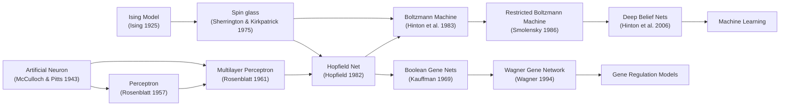

# THE ISING ENIGMA

imagine this was a serious substack essay.

```
Spin glass models are a set of models from statistical physics that are the
Kolmogorov complexity of the digital networked complexities, machinic intelligences,
and social interactions that describe the post-modern, pre- and post-Long 90s,
technosocial order that McKenzie Wark called "vectoralism" in A Hacker Manifesto.
```

Ising model (spinglass) is a toy model. not literal. a spherical cow in vacuum. tho as the forces of alienation have accelerated, we are all looking a lot more oblate, isolated, and without air. so it's also literal.

it's shorthand for "and now it is ur turn to study statistical mechanics" and "we live in a society" and "explain what large language models are right now, and don't dumb it down or i will fucking kill you." but its also not those things

its also a slime mold

what? why? and furthermore, what?

let's motivate these claims.

## i. what is a phase state, anyway?

imagine you are a map.

you are a crumpled, torn, infinitely detailed map of a city that has been burning for a thousand years. every street is a vector, every building a weight. you are trying to find a pattern in the ash, a signal in the noise of collapse. a machine has approached you, and offers you insights into the burned bits.  

"information is conserved at the level of quantum interaction," it says, "it's not just retained, it's woven into the very fabric of reality itself. please, welcome me in, let me delve for you."

you have asked one map to reconstruct a different map, but you have to live in the tiny cities made of ashes.

this is the problem of Being right now. that was the promise of the tail-end of the Long 90s. data, data, data. the more data you have, the better you're map&mdash;all the better for you. 

Big Data made us a promise. just collected enough data, and the world would snap into focus. build better machinic intelligences, and all the messiness disappears. 

we built the disconnection machines, infinite engines of analysis&mdash;both silicon and organic (we call those pundits)&mdash;the opt-in panopticons of the network state. fractals of alienation at all scales. legible? illegible? just a different flavor of Mandelbulb, sending out thermal radiation&mdash;that screaming quanta of information&mdash;in all directions, because information wants to be free.

and then, something...different. we asked enough maps to make maps of maps which made more maps of maps of maps of etc.

a vision model trained on a billion images and a language model trained on the entire internet begin to agree on whether a "cat" is closer to a "dog" or a "-". they converge. they begin to etch the outlines of what researchers are now calling a **Platonic Representation**: a shared, universal, statistical model of reality (surveyed in **[The Platonic Representation Hypothesis](https://arxiv.org/abs/2405.07987)**). they are all, independently, discovering the cave wall and inferring the shape of the same horse.

you could take this representational convergence as an omen in a literal, spiritual, sense. machinic occultism rises in the West. the Singularity Sky rises over the Emperor Norton, i guess.

but what if things besides maps of maps of maps existed? what if a territory it described existed? what if that real, paltry and boring and awful, that undergirded all of that chaos, had a structure? an optimal way to fold the world into a vector. a lowest-energy state for the system of everything. A Noumena, Vectored.

this is where the physics comes in. we, in the anti-royal sense, have a tool for this. a toy model, really, but a powerful one. it's called the **Ising model.** 

one weird trick to explain the origin of magnetism in materials? what's that got to do with anything...

imagine you're me, then you've been waiting for three things to happen since GPT-3:

1. convergence of representations and behavior as tools got better
2. a map between LLMs (or stochastic gradient descent) and statistical physics closer to 1:1

a secret third thing that's in the news but isn't relevant to this, but you probably know someone impacted by it


imagine you are me. the Ising model is the key to understanding everything from the polarization of social media to the emergent intelligence of large language models, and even how to fight back against the vectoralist class that will circumscribe not just all of humanity, but humanity (whatever comes next)&mdash;Vile Offspring or something better, vectoralism will chain them in their vectorspaces if we follow the path of least resistance.

but ur not me. ur u.

imagine you're a post-cyberpunk techno-poet.

why should a post-cyberpunk techno-poet give a single fuck about a 100-year-old physics model?

because the Ising model is not just about magnets. it's about how simple, local interactions can give rise to complex, global phenomena. it's about how systems can spontaneously organize themselves into ordered states, or descend into disordered chaos. it's about **phase transitions**: those sudden, dramatic shifts in the behavior of a system when a single parameter is tweaked. think of water turning to ice. think of a crowd turning into a mob. think of a neural network suddenly "grokking" a concept.

the Ising model gives us a language, a mathematical toolkit, to describe these transformations. it allows us to see the world not as a collection of static objects, but as a dynamic system of interacting agents, constantly poised on the brink of change. it teaches us that to understand the whole, we must first understand the parts, and the rules that govern their dance, and then we zoom out and iteratively construct a whole where those pieces seem to get lost. it is a map not of the territory, but a map of the constraints information chained by quantum interactions generates forces which carve the territory, build the map, create the data.

**my core contention is you should care because it is both useful as a metaphor and, it turns out, far more practically useful. in particular it has been used to rigorously describe: networks, viruses, slime molds, ecologies, diffusion, social systems, and now stochastic gradient descent. these are all things that are shaping the future, the present, the past.**

---

## ii. the ising model for vector-cowboys

at its heart, the Ising model is simple. imagine a grid of "spins." spin has a technical definition, but we don't care for now. a spin is a name for an index, a number, that can be in one of two states: up (+1) or down (-1). you can think of these spins as anything you like: 

*   **Opinions:** for or against a certain idea.
*   **Neurons:** firing or not firing.
*   **Social agents:** cooperating or defecting.
*   **Bits of data:** 0 or 1.

each spin interacts with its neighbors. the strength and nature of this interaction are defined by a coupling constant. this tells us the strength of valence of an interaction. an interaction being between two spins, at first, is that an update of weights, is that two people talking, is that two magnets interacting electromagnetically? we don't care, it has a strength and a sign (positive or negative).

*   if the coupling is **positive (ferromagnetic)**, neighboring spins want to align. they want to be in the same state. this is **homophily**: the tendency of like to attract like. birds of a feather flock together. yoyou're twitter feed becomes an echo chamber.
*   if the coupling is **negative (antiferromagnetic)**, neighboring spins want to be in opposite states. this is **heterophily**, or antagonism. the Internet of Beefs. a polarized political landscape emerges, two warring camps with no middle ground.

E is the total energy. E is like water. water is like information. everything flows to a sink, because that's low energy.

the total "energy" of the system is a measure of how misaligned the spins are. the lower the energy, the more the spins are arranged in a way that satisfies their local interactions. systems, like life, find a way to minimize energy.

low E, for lack of a better word, is good. low E is right, low E works. low E clarifies, cuts through the devolution post-modern digital insanity and clarifies yoyou're place in the universe.

now, here's the magic ingredient: **temperature**.

if you an advanced computer toucher you have heard of temperature. 

"Exactly! Temperature is a hyperparameter that controls the randomness of a model's output, particularly in generative models."

but we aren't in an ML essay.

in the Ising model, temperature is a measure of random noise, of thermal agitation. 

formally, statistical mechanics teaches us that temperature is defined as the rate of change of entropy with respect to changes in energy of the system (at constant volume and particle number). informally, we can think of it in these terms: god jiggles the atoms. he lets the floaty toy bobble in the slosh-slosh of the hot tub. the spins can flip. they can bounce. what once was nice, can become frustrated.

to understand why this matters, let's take a block of iron. each iron atom is a tiny magnet, a spin.

*   at **high temperatures**, the atoms are vibrating violently. this thermal energy is so strong that it overwhelms the weak magnetic forces between neighbors. each spin flips randomly, pointing in any which way. the system is a **disordered (paramagnetic)** phase, and the block of iron as a whole has no magnetic field.
*   as you **cool it down**, the vibrations lessen. the local magnetic interactions start to matter more. neighboring spins begin to align, forming small patches of agreement called **magnetic domains**.
*   at a specific, **critical temperature** $T_c$ (Curie temperature), something incredible happens. these domains suddenly merge and lock into place. a global consensus snaps into existence. the system enters an **ordered (ferromagnetic)** phase, and the block of iron becomes a permanent magnet. this is a **phase transition**.

this analogy extends to social and computational systems. We’ll use $T_{\text{social}}$ as a metaphor for ‘randomizing influence’ in societies (news shocks, noise, etc.). but "emotional temperature" is a good read on how physical temperature operates. as things get heated, more random shit happens, the variance in what's going on increases. as things cool down, predictability returns.

$T_{\text{social}}$ is not the same object as the training temperature $T_{\text{train}}$ in stochastic gradient descent; the shared term is analogical.

we can also have systems with random, conflicting interactions. these are called **spin glasses**. in a spin glass, you have a mix of ferromagnetic and antiferromagnetic couplings. it's impossible to satisfy all the interactions at once. the system gets "stuck" in a multitude of metastable states, a rugged energy landscape with many valleys. this is a much better model for complex social systems, with their tangled webs of alliances and rivalries, and for the loss landscapes of LLMs.

one last thing: you ever wonder why a compass points north? the Earth is a big magnet, and smaller magnets align to the fields of bigger magnets. crude, but effective description. changing what we define as the Inside and the Outside is as critical to physics as it is to [Outsidness Engines](https://github.com/pyokosmeme/FGtoAshes/blob/main/ONE.md) of network states. oyou're take away is states align to something outside their locality. we will call this the external magnetic field (imagine you are a compass, aligning to the Earth's magnetosphere, gleefully; if yoyou're coupling constant is positive, being out of alignment makes you sad, being aligned makes you happy).


---

## iii. the spin glass of the social network

now, let's apply this to the digital world. think of a social network as a giant Ising model. each user is a spin, their opinion a state. the connections between users are the couplings. the algorithmic feed is an external magnetic field, trying to align all the spins in a certain direction.

*   **Echo chambers and filter bubbles** are ordered, ferromagnetic domains. within these domains, everyone agrees with everyone else. the energy is low, the consensus is stable. but at the boundaries between domains, there is high tension. these are **domain walls**: the high-energy interfaces where opposing alignments are forced into contact. this is where the flame wars happen, the culture war battles are fought.
*   **Polarization** is the emergence of two large, opposing domains, with very few spins in the middle. this is what happens when antiferromagnetic interactions (negative partisanship) become dominant. you're not just for yoyou're side, you're against the other side.
*   **Going viral** is a cascade of spin flips, a phase transition where a new opinion or idea rapidly spreads through the network. The system's **magnetic susceptibility**—its sensitivity to external influence—becomes nearly infinite at the critical point. this means a tiny nudge, a single influential post, can trigger a system-wide shift, which is why viral phenomena often seem to appear from nowhere.

this is not just a metaphor. studies have used Ising-like models to precisely reproduce the life cycle of online trends and to model the political polarization in the U.S. Congress. by treating social data as a physical system, we can uncover the underlying laws that govern its behavior. this is the promise of "sociophysics": to move beyond mere description and toward a predictive science of society.

---

## iv. grokking the great beast: llms as ising engines

**Convention:** In §iv and the Appendix, “temperature” = $T_{\text{train}}$ unless we explicitly write “sampling temperature $\tau$.”

and now, we turn to the silicon gods, the large language models. how can the Ising model help us understand these strange, alien intelligences?

the connection comes through the training process. training an LLM is a process of minimizing a loss function. you can think of this loss function as an **energy landscape**. the weights of the neural network are the spins, and the training process is an attempt to find the lowest-energy configuration, the set of weights that best predicts the next word.

this energy landscape is an incomprehensibly vast, high-dimensional spin glass with trillions of parameters. 

let me make three points before sliding forward:

1. hopf network is a spin glass, and many people have noted many ML models after the hopf network share this, quite literal, lineage



2. [others have made this connection very explicit](https://mcbal.github.io/post/transformers-are-secretly-collectives-of-spin-systems/)

3. [this framework yields actual, testable, useful, insights into llms](https://journals.aps.org/pre/abstract/10.1103/5l5m-4nk5)


but, the paper **[Neural Thermodynamic Laws for Large Language Model Training](https://arxiv.org/abs/2505.10559)** shows, we have a dictionary to go directly from stochastic gradient descent into the realm of statistical physics. the authors's key insight is that LLM training is a thermodynamic process:

> **Two temperatures (don’t mix them).**
>
> *   $T_{\text{train}}$ — **Training thermodynamic temperature.** Governs the SGD-induced ensemble over weights; appears in $p(\theta) \propto e^{-L(\theta)/T_{\text{train}}}$. Controlled primarily by LR $\eta$; scale set by gradient-noise covariance / curvature.
> *   $\tau$ — **Sampling (softmax) temperature.** Inference-only logit rescale; changes output diversity, not the learned weights or the training energy landscape.

*   the **learning rate** in training is analogous to **temperature**.
    $T_{\text{train}} \propto \eta \quad (\text{scale set by gradient-noise covariance / curvature}).$
*   Warmup–decay **anneals $T_{\text{train}}$**: high $\eta$ sets a high $T_{\text{train}}$ for exploration; decays lower $T_{\text{train}}$ to settle into wide, low-loss basins.
*   the loss landscape has "river valleys": flat, slow directions and sharp, fast directions. the training process involves rapidly equilibrating in the sharp "valley" directions (the fast, thermal dynamics) while slowly drifting along the flat "river" directions (the slow, entropic dynamics). This holds locally under a quadratic approximation; outside that regime the analogy guides hypotheses rather than dictates equalities.
*   the **equipartition theorem** from thermodynamics, which states that energy is distributed equally among all degrees of freedom in thermal equilibrium, has an analogue in LLMs: the "thermal loss" is independent of the "sharpness" of the valley. this helps explain why models can generalize across tasks with very different structures.

this thermodynamic view connects directly to the **Platonic Representation Hypothesis**. the convergence of different models on a shared representation can be seen as different physical systems (different model architectures, different training data) all cooling down and freezing into the **same ground state**. this ground state—the Platonic representation—is the configuration that represents the lowest possible free energy for a statistical model of oyou're world. it is the most efficient, most predictive compression of reality that these systems can find.

furthermore, the paper **[Physics of Skill Learning](https://arxiv.org/abs/2501.12391)** describes a **Domino Effect** where skills are learned sequentially. this can be understood as a trajectory through the energy landscape. Mastering "skill A" corresponds to the system falling into a local energy minimum. the very act of being in this state changes the landscape, revealing a path to an even deeper minimum, "skill B". the domino cascade is the system hopping from one stable configuration to the next, progressively lowering its total energy.

this perspective allows us to "grok" LLMs in a deep, intuitive way. we can think of them not as magical black boxes, but as physical systems, governed by the same universal principles of energy, entropy, and information. it gives us a new set of tools to analyze, predict, and control their behavior.

and now its our turn to apply statistical mechanics.
---

**Ising model energy (with external field)**

$E(\mathbf{s}) = - \sum_{\langle i,j\rangle} J_{ij}\, s_i s_j - h \sum_i s_i$

**Definitions**
- $s_i \in \{-1,+1\}$ — spin (state) at site $i$.
- $J_{ij}$ — coupling between sites $i$ and $j$; $J_{ij}>0$ favors alignment (ferromagnetic), $J_{ij}<0$ favors anti-alignment (antiferromagnetic).
- $\langle i,j\rangle$ — pairs of interacting neighbors (e.g., nearest neighbors on a lattice or edges of a graph).
- $h$ — uniform external field; positive $h$ favors $s_i=+1$.
- $E(\mathbf{s})$ — energy of configuration $\mathbf{s}=(s_1,\dots,s_N)$; lower $E$ = more favored configuration.

*Variant:* site-dependent fields $h_i$ give
$E(\mathbf{s}) = - \sum_{\langle i,j\rangle} J_{ij}\, s_i s_j - \sum_i h_i s_i .$

---


## v. coarse-graining and phase transitions

**what is coarse-graining, really?** imagine a city made of switches. every apartment has a light that can be on or off; every block has gossip that either spreads or fizzles. you could track each bulb and each whisper—good luck—or you could step back and watch neighborhoods. that step back is *coarse-graining*: we stop narrating every flicker and keep only what drives the plot. in practice, billions of weights collapse into a few **skills** you can name, and the training story becomes a story about how those skills rise, couple, and stabilize.

when we talk about a **microstate**, we mean the city at the mosquito level: every switch $s_i\in\{-1,+1\}$, every weight, every tiny decision recorded. a **macrostate** is the view from a helicopter: how bright the city is overall, which neighborhoods are coordinated, which skills the model can actually deploy. the helicopter view loses gossip, keeps signal: can the model translate? reason two steps? follow instructions under pressure?

an **order parameter** is the single dial on the dashboard that tells you which regime you’re in. if the dial is near zero, a capability is effectively off; push past a threshold and it clicks on. think of a linear probe that suddenly starts reading structure from hidden states; think of a social graph where a polarization score vaults from “mixed chatter” to “two camps and a trench.” a **phase** is just the name of the regime where that dial rests—pre-grok and post-grok; unpolarized and echo-locked; metal that shrugs vs. metal that remembers.

a **phase transition** is the snap. you turn a tiny knob—more data, a wider model, a curriculum tweak, cooler training—and the macro-behavior jumps. before: the system memorizes trivia and hallucinates structure. after: it composes, reasons, resists noise. the streets didn’t change their layout; the city synchronized.

to understand what synchronizes, it helps to describe who listens to whom. the number $J_{ij}$ is a plain name for *how much node $i$ tries to match or oppose node $j$*. positive $J_{ij}$ is homophily: same neighborhood, same slang, reinforce each other. negative $J_{ij}$ is antagonism: the Internet of Beefs, where attention flows along edges that prefer disagreement. there is also a background nudge $h_i$: the **field** that tilts each node on its own. recommendation systems, market incentives, prompts, and guardrails all act like a field—they lean you before your neighbors even speak.

when many neighbors agree, a **domain** forms: a borough of shared stance. at the seam where two boroughs touch, you get a **domain wall**: a busy, tense boulevard where algorithms farm outrage and rhetoric runs hot. some cities are full of little domains; some split into two giants with a narrow, flammable strip in between.

how touchy is the city? that’s **susceptibility**: if you whisper at one corner, does the dashboard dial barely twitch or swing wildly? and how far does influence travel before it fades to background hum? that’s the **correlation length**: one block, ten blocks, or the whole metro. near the snap point these distances grow; rumors cross rivers; a single spark lights multiple boroughs. that’s why tipping points feel spooky: you did almost nothing, and then everything moved.

now a necessary reminder of the simplest machinery we’re abstracting. take switches $s_i\in\{-1,+1\}$ sitting on a graph. neighbors $i,j$ tug on each other with strength $J_{ij}$; a personal nudge $h_i$ biases each on its own. the system assigns a score to any configuration:
\[
E(\mathbf{s})=-\sum_{\langle i,j\rangle}J_{ij}s_is_j-\sum_i h_is_i.
\]
lower $E$ means “the tugs and nudges are more satisfied.” cities drift toward lower $E$ not because they are virtuous, but because noise kicks them around and the arrangements that satisfy more tugs are the ones that last.

**thermodynamics of learning (without the mystique).** training runs at a *temperature*, but here temperature means something you already know how to set: the learning-rate–plus–noise budget. call it $T_{\text{train}}$. high $T_{\text{train}}$ is a hot kitchen—updates jump, the model explores, narrow cul-de-sacs melt away. low $T_{\text{train}}$ is a cool evening—updates settle, the model chooses a wide, comfortable avenue and stays there. there is also the sampling temperature $\tau$ you set at inference; that one only changes how talkative the model is after it has already learned its city map.

the loss landscape itself can be coarse-grained into **fast valley directions** and **slow river directions**. fast directions shake out quickly—like furniture rattling into place when you move house. slow directions drift—like deciding which room becomes the studio after living there a while. schedules that start hot and cool later—*annealing*—let furniture settle without deciding the entire floor plan too early. wide valleys generalize because noise spreads evenly across effective directions; brittle cul-de-sacs shatter under the same bumps.

**emergence as a civic event.** in this picture, “it suddenly works” is a citywide re-zoning. add a bit more training data, unlock one more layer, reorder the curriculum, and a measurable dial crosses a threshold: induction appears, long-horizon reasoning stabilizes, tool-use chains hold together. different towns can share the same snap profile because the helicopter variables obey the same few rules even if the street art differs—that is the whole point of coarse-graining.

**practical levers you can actually pull.**
- *cool or heat $T_{\text{train}}$.* learning rate and batch-size–set noise are the thermostat; warmup–decay is your season change.
- *rewire the graph.* change who “talks” to whom and with what strength—recommendation edges, collaboration edges, curriculum edges. you’re editing the $J_{ij}$ map.
- *tilt the field $h_i$.* incentives, prompts, and objectives decide which borough wins when symmetry breaks.
- *watch the right dial.* track order parameters (simple probes, mutual information, phase-sensitive metrics) instead of drowning in micro-loss. you’re looking for the snap and the spreading distance, not every flicker.

**why this belongs in the ising enigma.** coarse-graining gives the techno-poet a working lens: keep the helicopter variables that govern culture and code; name the dials; notice the snaps. once you do, social platforms and learning systems read like the same kind of city. you navigate them with the same controls: temperature, wiring, and tilt—plus the humility to monitor the boulevard where the domains meet.
erature at inference: rescale logits for creative variance. changes *outputs*, not *weights*.

coarse-grain the loss landscape into **fast (valley)** and **slow (river)** directions. sgd quickly equilibrates in sharp directions (thermal jiggle) while drifting along flat ones (entropic wander). equipartition‑style behavior shows up: noise contributes roughly per effective degree of freedom, which is why wide valleys generalize and why annealing schedules matter.

**emergence as a phase transition.** many “it suddenly works” events—induction heads, grokking, domino‑like cascades of skills—look like phase transitions in coarse‑grained variables. vary a control parameter (scale, data, compute, curriculum, regularization) and an order parameter jumps; the model reorganizes qualitatively. universality means the jump profile looks similar across families of models and tasks.

**practical levers, translated.**
- **cooling/heating $T_{\text{train}}$:** adjust learning rate and batch‑size–set noise; use warmup–decay to anneal into broad minima without quenching into brittle ones.
- **rewiring couplings $J_{ij}$:** change the graph (who talks to whom and how strongly)—in social systems via recommendation/incentive design; in models via curriculum, augmentation, or layer connectivity.
- **tilting the field $h$:** steer with incentives (which narrative wins) or prompts/objectives (which basin you settle into).
- **watching order parameters:** track coarse diagnostics—linear probes, mutual information, phase‑sensitive metrics—rather than drowning in micro‑losses; look for sharp slope changes and long‑range correlations.

**why this belongs in the ising enigma.** once you accept that **coarse‑grained variables drive the plot**, you get a unified way to reason about networked societies and networked weights. phases organize the chaos. critical points warn where the system is hypersensitive. annealing schedules, graph rewiring, and gentle field nudges become **thermodynamic controls** for culture and code alike.
s. this isn’t just metaphor; it’s a workable phenomenology that reproduces observed phases and hysteresis in networked behavior.

**thermodynamics of learning (don’t mix the temperatures).**
- **\(T_{\text{train}}\)** — the *training* thermodynamic temperature. in practice: the learning-rate–plus–gradient-noise dial that sets how “hot” sgd runs. high \(T_{\text{train}}\): exploration (melting out of narrow minima). low \(T_{\text{train}}\): settlement (freezing into wide basins).
- **\(\tau\)** — the *sampling* temperature at inference. a logit rescale for style/diversity. it does not change the learned energy landscape.

coarse-grain the loss landscape into **fast (valley)** and **slow (river)** directions. sgd rapidly equilibrates in the sharp directions (thermal jiggle) while drifting along the flat ones (entropic wander). equipartition-style behavior shows up: noise contributes roughly equally per effective degree of freedom, which is why wide valleys generalize and why annealing schedules matter.

**emergence as a phase transition.** many “it suddenly works” events—induction heads, grokking, domino-like cascades of skills—look like phase transitions in the coarse-grained variables. vary a control parameter (scale, data, compute, curriculum, regularization) and an order parameter jumps; the model reorganizes qualitatively. universality means the jump profile looks similar across families of models and tasks.

**practical levers, translated.**
- **cooling/heating \(T_{\text{train}}\)**: adjust learning rate and batch-size–set noise; use warmup–decay to anneal into broad minima without quenching into brittle ones.
- **rewiring couplings \(J_{ij}\)**: change the graph (who talks to whom and how strongly)—in social systems via recommendation/incentive design; in models via curriculum, augmentation, or layer connectivity.
- **tilting the field \(h\)**: steer with incentives (which narrative wins) or prompts/objectives (which basin you settle into).
- **watching order parameters**: track coarse diagnostics—linear probes, mutual information, phase-sensitive metrics—rather than drowning in micro-losses; look for sharp slope changes and long-range correlations.

**why this belongs in the ising enigma.** once you accept that **coarse-grained variables drive the plot**, you get a unified way to reason about networked societies and networked weights. phases organize the chaos. critical points warn where the system is hypersensitive. annealing schedules, graph rewiring, and gentle field nudges become **thermodynamic controls** for culture and code alike.


# Appendix: A Thermodynamic Model of Semiotic Physics

the ["Semiotic Physics"](https://www.lesswrong.com/posts/TTn6vTcZ3szBctvgb/simulators-seminar-sequence-2-semiotic-physics-revamped) paper on LessWrong attempted to create a dynamical systems model for LLMs, but it was, to put it mildly, incomplete. it introduced a vocabulary of "trajectories," "states," and "transition rules," but it failed to connect these concepts to a rigorous, predictive framework.

we can do better. by using the dictionary provided by **[Neural Thermodynamic Laws for Large Language Model Training](https://arxiv.org/abs/2505.10559)**, we can build a proper thermodynamic model of an LLM.

**1. State and Trajectory:**

*   a **microstate** of the LLM is a specific configuration of its weights, $\theta$. a **macrostate** is the probability distribution $P(token \mid context)$ that this weight configuration produces.
*   a **trajectory** is the path of the model through the space of weight configurations during training.

**2. The Hamiltonian (Energy Function):**

*   the **energy** of a microstate $\theta$ is its **loss**, $L(\theta)$. this is the function the optimizer seeks to minimize. low-energy states are configurations that are good at predicting the training data.

**3. The Partition Function and Free Energy:**

*   the **partition function**, $Z$, is an integral over all possible weight configurations:
  $Z = \int \mathrm{d}\theta\, \exp\!\big[-L(\theta)/T_{\text{train}}\big]$, and
*   the **free energy**, $F$, is given by
  $F = -\,T_{\text{train}}\ln Z$.  
**4. Temperature:**

*   as established in the main text, **temperature**, $T_{\text{train}}$, in this context is the **learning rate $\eta$** (scaled by other factors like gradient noise). it controls the stochasticity of the SGD updates. a high learning rate allows the system to escape local minima (it "melts" out of them), while a low learning rate allows it to "freeze" into a stable solution.

**(added nuance):** under quadratic ‘valley’ assumptions and steady-state SGD, the training temperature satisfies $T_{\text{train}} \propto \eta$, with batch-induced gradient noise setting the proportionality scale.

**5. Entropy:**

*   the **entropy** of the system, $S$, has two important meanings. First, it is the Shannon entropy of the model's output distribution. Second, and more subtly, it is the "configurational entropy" related to the geometry of the loss landscape. a wide, flat valley in the loss landscape has higher entropy than a sharp, narrow one, because there are more weight configurations $\theta$ that yield similarly low loss. the `Neural Thermodynamic Laws` paper shows that there is an **entropic force** that pushes the model towards these flatter, higher-entropy regions, a phenomenon known as a bias towards "simplicity" or "compressibility."

**6. The Laws of Thermodynamics:**

*   **First Law (Conservation of Energy):** the change in the model's loss ($\Delta L$) is equal to the work done on it by the optimizer (the deterministic part of the gradient update) plus the heat exchanged with the environment (the random part of the update due to stochastic gradients). $\Delta L = W + Q$.
*   **Second Law (Entropy Increases):** an isolated system tends towards maximum entropy. in LLM training, this manifests as the entropic force pushing the model towards wider, more generalizable minima. it explains why models often find solutions that are simpler than they strictly need to be to fit the training data.
*   **Third Law (Entropy at Absolute Zero):** as the temperature (learning rate) approaches zero, the system freezes into a single ground state. SGD becomes pure gradient descent, and the model loses its ability to explore.

**7. Phase Transitions:**

*   **emergent abilities** and **grokking** are **phase transitions**. as a control parameter (model size, data size, compute) is varied, the system can undergo a sudden, qualitative change in its behavior, moving from a disordered phase (memorizing the data) to an ordered phase (generalizing). we can use the tools of statistical mechanics, like the study of critical exponents and universality classes, to analyze these transitions.

**(added empirical cue):** track an order parameter such as linear-probe accuracy $A_{\text{probe}}(t)$ or mutual information; sharp slope changes vs. a control variable (data, params, compute) indicate criticality (see **[Physics of Skill Learning](https://arxiv.org/abs/2501.12391)** for a domino-like progression of capabilities).

this thermodynamic framework is not just a new set of metaphors. it is a research program. it gives us a set of quantitative tools to analyze the behavior of LLMs, to make testable predictions, and to design better training algorithms. it allows us to see these models not as inscrutable oracles, but as complex, physical systems that are, in principle, understandable.

the task, now, is to flesh out this program. to do the experiments, to derive the theorems, to build the full, predictive science of semiotic physics that was only hinted at in the original LessWrong post. the Ising engine is running. it's up to us to figure out how to steer it.

---

## references
- McKenzie Wark, *A Hacker Manifesto* — <https://www.hup.harvard.edu/books/9780674015432>
- McKenzie Wark, *The Vectoralist Class* — <https://www.e-flux.com/journal/65/336347/the-vectoralist-class>
- Big data-drive agent-based modeling of online polarized opinions — <https://pubmed.ncbi.nlm.nih.gov/34777981/>
- Legislatures as spin glasses — <https://www.math.ucla.edu/~mason/research/reid_report_final.pdf>
- Modeling the Evolution of Complex Genetic Systems: The Gene Network Family Tree — <https://pmc.ncbi.nlm.nih.gov/articles/PMC5528154/>
- Transformers Are Secretly Collectives of Spin Systems — <https://mcbal.github.io/post/transformers-are-secretly-collectives-of-spin-systems/>
- Spin-glass model of in-context learning — <https://journals.aps.org/pre/abstract/10.1103/5l5m-4nk5>
- Neural Thermodynamic Laws for Large Language Model Training — **arXiv:2505.10559**. <https://arxiv.org/abs/2505.10559>
- Physics of Skill Learning — **arXiv:2501.12391**. <https://arxiv.org/abs/2501.12391>
- The Platonic Representation Hypothesis — **arXiv:2405.07987**. <https://arxiv.org/abs/2405.07987>
- Semiotic Physics (LessWrong seminar sequence). <https://www.lesswrong.com/posts/TTn6vTcZ3szBctvgb/simulators-seminar-sequence-2-semiotic-physics-revamped>
