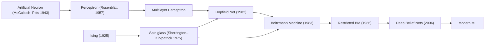

# THE ISING ENIGMA (Maximal Cut—Restored & Sharpened, Linked)

_imagine this was a serious substack essay._

```
Spin glass models are a set of models from statistical physics that are the
Kolmogorov complexity of the digital networked complexities, machinic intelligences,
and social interactions that describe the post-modern, pre- and post-Long 90s,
technosocial order that McKenzie Wark called "vectoralism" in A Hacker Manifesto.
```

Ising model (spinglass) is a toy model. not literal. a spherical cow in vacuum. tho as the forces of alienation have accelerated, we are all looking a lot more oblate, isolated, and without air. so it's also literal.

it's shorthand for "and now it is ur turn to study statistical mechanics" and "we live in a society" and "explain what large language models are right now, and don't dumb it down." but its also not those things.

its also a slime mold.

what? why? and furthermore, what?

let's motivate these claims.

---

## Temperature legend (pin this)

- $T_{\text{train}}$: **training thermodynamic temperature** induced by learning rate and gradient noise in SGD; appears in the weight‑ensemble $p(\theta)\propto e^{-L(\theta)/T_{\text{train}}}$. Controls exploration vs. settlement during training. See **Neural Thermodynamic Laws for LLM Training** ([arXiv:2505.10559](https://arxiv.org/abs/2505.10559)).
- $\tau$: **sampling temperature** at inference. Rescales logits; changes output diversity, not the learned energy landscape.
- $T_{\text{social}}$: **social volatility** proxy (exogenous noise, shock rate). A metaphor useful for opinion dynamics; **distinct** from $T_{\text{train}}$.

We will keep these symbols fixed throughout. No other temperature symbols will appear.

---

## i. what is a phase state, anyway?

imagine you are a map.

you are a crumpled, torn, infinitely detailed map of a city that has been burning for a thousand years. every street is a vector, every building a weight. you are trying to find a pattern in the ash, a signal in the noise of collapse. a machine has approached you, and offers you insights into the burned bits.  

"information is conserved at the level of quantum interaction," it says, "it's not just retained, it's woven into the very fabric of reality itself. please, welcome me in, let me delve for you."

you have asked one map to reconstruct a different map, but you have to live in the tiny cities made of ashes.

this is the problem of Being right now. that was the promise of the tail-end of the Long 90s. data, data, data. the more data you have, the better you're map—all the better for you. 

Big Data made us a promise. just collect enough data, and the world would snap into focus. build better machinic intelligences, and all the messiness disappears. 

we built the disconnection machines, infinite engines of analysis—both silicon and organic (we call those pundits)—the opt-in panopticons of the network state. fractals of alienation at all scales. legible? illegible? just a different flavor of Mandelbulb, sending out thermal radiation—that screaming quanta of information—in all directions, because information wants to be free.

and then, something...different. we asked enough maps to make maps of maps which made more maps of maps of maps of etc.

a vision model trained on a billion images and a language model trained on the entire internet begin to agree on whether a "cat" is closer to a "dog" or a "-". they converge. they begin to etch the outlines of what researchers are now calling a **Platonic Representation**: a shared, universal, statistical model of reality (surveyed in **The Platonic Representation Hypothesis** — [arXiv:2405.07987](https://arxiv.org/abs/2405.07987)). they are all, independently, discovering the cave wall and inferring the shape of the same horse.

you could take this representational convergence as an omen in a literal, spiritual, sense. machinic occultism rises in the West. the Singularity Sky rises over the Emperor Norton, i guess.

but what if things besides maps of maps of maps existed? what if a territory it described existed? what if that real, paltry and boring and awful, that undergirded all of that chaos, had a structure? an optimal way to fold the world into a vector. a lowest-energy state for the system of everything. A Noumena, Vectored.

this is where the physics comes in. we, in the anti-royal sense, have a tool for this. a toy model, really, but a powerful one. it's called the **Ising model.** 

one weird trick to explain the origin of magnetism in materials? what's that got to do with anything...

imagine you're me, then you've been waiting for three things to happen since GPT-3:

1. convergence of representations and behavior as tools got better;
2. a map between LLMs (or stochastic gradient descent) and statistical physics closer to 1:1;
3. a secret third thing that's in the news but isn't relevant to this, but you probably know someone impacted by it.

imagine you are me. the Ising model is the key to understanding everything from the polarization of social media to the emergent intelligence of large language models, and even how to fight back against the vectoralist class that will circumscribe not just all of humanity, but humanity (whatever comes next)—Vile Offspring or something better, vectoralism will chain them in their vectorspaces if we follow the path of least resistance.

but ur not me. ur u.

imagine you're a post-cyberpunk techno-poet.

why should a post-cyberpunk techno-poet give a single fuck about a 100-year-old physics model?

because the Ising model is not just about magnets. it's about how simple, local interactions can give rise to complex, global phenomena. it's about how systems can spontaneously organize themselves into ordered states, or descend into disordered chaos. it's about **phase transitions**: those sudden, dramatic shifts in the behavior of a system when a single parameter is tweaked. think of water turning to ice. think of a crowd turning into a mob. think of a neural network suddenly "grokking" a concept.

the Ising model gives us a language, a mathematical toolkit, to describe these transformations. it allows us to see the world not as a collection of static objects, but as a dynamic system of interacting agents, constantly poised on the brink of change. it teaches us that to understand the whole, we must first understand the parts, and the rules that govern their dance, and then we zoom out and iteratively construct a whole where those pieces seem to get lost. it is a map not of the territory, but a map of the constraints information chained by quantum interactions generates forces which carve the territory, build the map, create the data.

**my core contention is you should care because it is both useful as a metaphor and, it turns out, far more practically useful. in particular it has been used to rigorously describe: networks, viruses, slime molds, ecologies, diffusion, social systems, and now stochastic gradient descent. these are all things that are shaping the future, the present, the past.**

---

## ii. the ising model for vector-cowboys

at its heart, the Ising model is simple. imagine a graph of "spins." a spin is a variable that can be in one of two states: up (+1) or down (-1). you can think of these spins as anything you like: 

* **Opinions:** for or against a certain idea.
* **Neurons:** firing or not firing.
* **Social agents:** cooperating or defecting.
* **Bits of data:** 0 or 1.

each spin interacts with its neighbors. the strength and nature of this interaction are defined by a coupling constant. this tells us the strength and the sign of an interaction.

* if the coupling is **positive (ferromagnetic)**, neighboring spins want to align. homophily. echo chambers.
* if the coupling is **negative (antiferromagnetic)**, neighboring spins want to anti-align. antagonism. the Internet of Beefs.

the total "energy" of the system is a measure of how satisfied those local interactions are. the lower the energy, the more the spins arrange to satisfy their tugs. systems drift to lower energy because noise shakes them and what survives is what fits.

now, here's the magic ingredient: **temperature**.

in the Ising model, temperature is a measure of random noise, of thermal agitation. above $T_c$: disorder (paramagnetic). below $T_c$: order (ferromagnetic).

we can also have systems with random, conflicting interactions: **spin glasses**. in a spin glass, a mix of ferromagnetic and antiferromagnetic couplings makes it impossible to satisfy everything at once; the landscape has many valleys and traps. that is closer to conflicted social systems—and to the loss landscapes of modern networks.

one last thing: the **external field**. the Earth is a big magnet, and smaller magnets align to it. in our social reading the “field” is recommendation, incentives, prompts—anything that leans you before your neighbors speak.

**Ising energy (with external field)**  
$E(\mathbf{s})=-\sum_{\langle i,j\rangle}J_{ij}s_is_j-\sum_i h_is_i.$

- $s_i\in\{-1,+1\}$ — spin (state) at site $i$.
- $J_{ij}$ — coupling between sites $i$ and $j$; $J_{ij}>0$ favors alignment; $J_{ij}<0$ favors anti‑alignment.
- $\langle i,j\rangle$ — interacting pairs (lattice neighbors or graph edges).
- $h_i$ — site‑dependent field; positive $h_i$ favors $s_i=+1$.

---

## iii. the spin glass of the social network

now, apply this to the digital world. a social network is a giant Ising model. each user is a spin, their opinion a state. the connections are couplings $J_{ij}$. the algorithmic feed is an external field $h_i$.

* **Echo chambers and filter bubbles** are ordered, ferromagnetic domains. within domains, everyone agrees; at the boundaries, **domain walls** form—the high‑tension interfaces where flame wars live.
* **Polarization**: two large, opposing domains with few spins in the middle. when negative partisanship strengthens, antiferromagnetic structure wins. hysteresis means “undoing the cause” doesn’t immediately undo the effect.
* **Going viral** is a cascade of spin flips, a phase transition where a new opinion spreads. the system’s **susceptibility** spikes near the critical point: tiny nudges (a seed post) trigger outsized responses.

this is not just a metaphor: Ising‑class models reproduce the lifecycle of online trends, segregation dynamics, and congressional polarization. for entry points: Castellano et al., “Statistical physics of social dynamics” (_Rev. Mod. Phys._ 2009, review); Gauvin et al., “The Schelling Model of Ethnic Residential Dynamics” (_Phys. Rev. E_ 2009); Nyczka & Sznajd‑Weron (2013, _Phys. Rev. E_).

---

## iv. grokking the great beast: llms as ising engines

**Convention for this section:** “temperature” means $T_{\text{train}}$ unless we explicitly write $\tau$.

training an LLM minimizes a loss—an **energy landscape**—over weights. the weights are the degrees of freedom; SGD is the dynamics. the landscape is spin‑glass‑like: many valleys, many saddles.

let me make three points before sliding forward:

1. hopfield networks are literally spin‑glass inspired; modern ML sits downstream of that lineage (see Hopfield 1982; Boltzmann Machines; RBMs; Deep Belief Nets).
2. transformers can be read as collectives of spin systems (see “Transformers Are Secretly Collectives of Spin Systems” — [blog](https://mcbal.github.io/post/transformers-are-secretly-collectives-of-spin-systems/)).
3. the SGD↔thermodynamics dictionary now makes this concrete: $T_{\text{train}}$ is set (up to scale) by learning rate and gradient‑noise; warmup/decay = annealing; fast directions equilibrate, slow directions drift; equipartition shows up in wide valleys (see **Neural Thermodynamic Laws for LLM Training** — [arXiv:2505.10559](https://arxiv.org/abs/2505.10559)).

- $T_{\text{train}}\uparrow$ → exploration; melt out of brittle minima.  
- $T_{\text{train}}\downarrow$ → settlement into wide basins.  
- anneal too fast and you quench—freeze defects in place; anneal thoughtfully and you get robustness.

the **Domino Effect**: capabilities light in sequence. master “A,” and the landscape reshapes, revealing a path to “B,” then “C.” this yields practical knobs (curriculum pacing, optimizer noise, data order) and matches observed scaling behavior (see **Physics of Skill Learning** — [arXiv:2501.12391](https://arxiv.org/abs/2501.12391)).



Also see the spin‑glass perspective on in‑context learning (PRE): **Spin‑glass model of in‑context learning** ([Phys. Rev. E](https://journals.aps.org/pre/abstract/10.1103/5l5m-4nk5)).

---

## v. coarse-graining: from microscopic chaos to macroscopic order

**the art of strategic forgetting.** imagine tracking every neuron firing in a brain versus asking “is this person thinking about food?” that compression—from billions of states to one meaningful question—is coarse‑graining. we deliberately forget microscopic details to reveal macroscopic patterns that matter for prediction and control.

**three levels of description**  
- **Microstate:** every spin $s_i\in\{-1,+1\}$, every weight, every tweet. $\mathbf{s}=(s_1,\dots,s_N)$.  
- **Mesostate:** clusters and domains. skills in an LLM, communities in a social network, magnetic domains.  
- **Macrostate:** the few numbers that capture behavior. magnetization $M=\frac{1}{N}\sum_i s_i$, a polarization index, a linear‑probe accuracy.

**order parameters as diagnostic instruments.** an order parameter $\phi$:
- is near zero in the disordered phase,
- turns on at the transition,
- then grows (continuously or by jump).

**examples**  
- magnetization for ferromagnets (zero above $T_c$, spontaneous below),  
- polarization score for social networks (mixed opinions → two camps),  
- linear‑probe accuracy for LLM capabilities (random → structured).

**the renormalization group insight.** zoom out, blur, repeat—near criticality, the system looks the same at every scale. universality explains why protests in Cairo, magnetization in iron, and grokking in transformers share power‑law behavior near their critical points.

**practical coarse‑graining for LLMs and social systems**  
For LLMs, the effective loss landscape decomposes into:
- **Fast directions:** sharp valleys where SGD quickly equilibrates (furniture finding its place).  
- **Slow directions:** flat rivers along which the model drifts entropically (architectural decisions).  

**effective temperature:** $T_{\text{train}}\propto \eta\cdot(\text{gradient noise scale})$ (see **Neural Thermodynamic Laws** — [arXiv:2505.10559](https://arxiv.org/abs/2505.10559)).

The domino cascade of skills maps to sequential phase transitions in different order parameters (see **Physics of Skill Learning** — [arXiv:2501.12391](https://arxiv.org/abs/2501.12391)):
- token prediction crosses a threshold → basic pattern matching emerges;  
- syntactic probes jump → grammar crystallizes;  
- reasoning benchmarks spike → compositional understanding locks in.

For social networks, multi‑scale dynamics appear as:
- **Local:** individual opinion flips (single‑spin updates),  
- **Mesoscale:** community consensus formation (domain growth),  
- **Global:** platform‑wide polarization (symmetry breaking).

**critical signals and control**  
Near phase transitions, systems exhibit universal warning signs. For complex systems and early‑warning signals, see Scheffer et al. (_Nature_ 2009; _Science_ 2012):

Signal | Mathematical form | Social systems | LLMs
---|---|---|---
critical slowing | $\tau\sim\|T-T_c\|^{-z\nu}$ | echo chambers solidify slowly | loss plateaus before grokking
growing fluctuations | $\chi\sim\|T-T_c\|^{-\gamma}$ | opinion swings amplify | gradient variance spikes
long‑range correlation | $\xi\sim\|T-T_c\|^{-\nu}$ | viral cascades span networks | features correlate across layers

**the thermodynamic control panel**
- **Temperature** (learning rate, social volatility): controls exploration vs. exploitation.  
- **Field $h$** (incentives, prompts): biases the symmetry‑breaking direction.  
- **Coupling matrix $J_{ij}$** (network topology, attention patterns): determines interaction structure.  
- **Annealing schedule:** start hot (explore), cool gradually (refine), avoid quenching (brittle solutions).

**why coarse‑graining matters for the ising enigma.** once you accept that a few macroscopic variables drive the entire plot—that phase transitions are real, measurable, and manipulable—you gain thermodynamic control over both silicon and carbon systems. the same mathematics that predicts when iron magnetizes tells you when Twitter polarizes and when GPT‑N groks arithmetic.

---

## vi. the “so what” problem (answered plainly)

**What does this buy you over other frameworks?**

1. **Early‑warning signals** that general agent models lack: rising variance, autocorrelation, and correlation length near critical points. This lets you forecast virality or polarization before it lands (cf. Scheffer et al., _Nature_ 2009; _Science_ 2012).
2. **Hysteresis accounting:** after a polarization transition, removing the cause doesn’t rewind the effect. You must cross a different threshold on the way back. That’s intervention‑design, not metaphor (see Castellano 2009 review for sociophysics hysteresis patterns).
3. **Minimal knobs with policy bite:** every platform or training policy maps to $(J,h,T)$. You can design counterfactuals and reason about side‑effects (e.g., quenching brittleness vs. slow anneal robustness).
4. **Bridging silicon↔society:** the same diagnostics (order parameters, susceptibility, correlation length) track both opinion cascades and capability cascades (see **Platonic Representation Hypothesis** — [arXiv:2405.07987](https://arxiv.org/abs/2405.07987)).

**Concrete, testable predictions & levers**

- **Susceptibility ridge before a viral flip.** Inject small, controlled “field” $h$ to seed posts and measure response gain. Expect a bulge before the transition; plan content throttles or burst buffers accordingly (cf. sociophysics literature above).
- **Hub‑targeted fielding.** In heavy‑tailed graphs, tilting top‑$k$ degree nodes outperforms random seeding for re‑magnetizing the network. AB‑test interventions on bridge hubs crossing domain walls.
- **Hysteresis audit.** Chart heating/cooling curves of polarization index as you vary antagonistic coupling and field. Do not expect symmetry.
- **Training anneal discipline.** Warmup–hold–decay schedules should be chosen to maintain near‑equilibrium in fast directions while letting slow coordinates drift; avoid quenching defects (brittle narrow minima). Monitor probe‑based order parameters, not just average loss (see **Neural Thermodynamic Laws** — [arXiv:2505.10559](https://arxiv.org/abs/2505.10559)).


---

## Appendix: A Thermodynamic Model of Semiotic Physics

The “Semiotic Physics” attempt (LessWrong) defined trajectories, states, and transition rules but lacked predictive anchors. The SGD↔thermodynamics dictionary fills that gap.

**1. State and Trajectory**  
- microstate: weights $\theta$.  
- macrostate: $P(\text{token}\mid\text{context})$.  
- trajectory: path $\theta(t)$ under SGD.

**2. Energy**  
- energy of $\theta$ is $L(\theta)$.

**3. Partition Function and Free Energy**  
- $Z=\int d\theta\,\exp[-L(\theta)/T_{\text{train}}]$;  
- $F=-T_{\text{train}}\ln Z$.

**4. Temperature**  
- $T_{\text{train}}\propto \eta$ up to noise‑scale factors; controls exploration vs. settlement (see **Neural Thermodynamic Laws** — [arXiv:2505.10559](https://arxiv.org/abs/2505.10559)).
- $\tau$ at inference rescales logits; does not change the learned landscape.

**5. Entropy**  
- output entropy vs. configurational (flat‑valley) entropy; entropic forces bias toward wider minima (simplicity/compressibility).

**6. Laws**  
- First: $\Delta L = W + Q$ (work by optimizer + stochastic heat).  
- Second: entropy tends to rise; wide minima dominate.  
- Third: as $T_{\text{train}}\to 0$, dynamics freeze; exploration ends.

**7. Phase transitions**  
- emergent abilities and grokking as phase transitions in coarse‑grained variables; track order parameters (e.g., linear‑probe accuracy) (see **Physics of Skill Learning** — [arXiv:2501.12391](https://arxiv.org/abs/2501.12391)).

---

## Selected empirical studies (to anchor the claims)

**Political Polarization & Opinion Dynamics**
- Castellano et al., “Statistical physics of social dynamics,” _Rev. Mod. Phys._ (2009).  
- Hołyst & Kacperski, “Phase transitions in social impact models of opinion formation,” _Physica A_ (2000).  
- Sornette & Zhou, “Ising model of financial markets with herding” (2006).

**Network Segregation & Echo Chambers**
- Gauvin et al., “Schelling model of ethnic residential dynamics,” _Phys. Rev. E_ (2009).  
- Nyczka & Sznajd‑Weron, “Phase transition in the social impact model of opinion formation,” _Phys. Rev. E_ (2013).

**Collective Behavior & Social Contagion**
- Kenna & Berche, “Critical mass and research quality vs. group size,” _Scientometrics_ (2011).  
- de Arruda et al., “Social contagion on hypergraphs,” _Phys. Rev. Research_ (2020).

**Early‑warning signals**
- Scheffer et al., “Early warning of critical transitions from critical slowing down,” _Nature_ (2009).  
- Scheffer et al., “Anticipating critical transitions,” _Science_ (2012).

---

## references
- McKenzie Wark, *A Hacker Manifesto* — <https://www.hup.harvard.edu/books/9780674015432>
- McKenzie Wark, *The Vectoralist Class* — <https://www.e-flux.com/journal/65/336347/the-vectoralist-class>
- Big data-drive agent-based modeling of online polarized opinions — <https://pubmed.ncbi.nlm.nih.gov/34777981/>
- Legislatures as spin glasses — <https://www.math.ucla.edu/~mason/research/reid_report_final.pdf>
- Modeling the Evolution of Complex Genetic Systems: The Gene Network Family Tree — <https://pmc.ncbi.nlm.nih.gov/articles/PMC5528154/>
- Transformers Are Secretly Collectives of Spin Systems — <https://mcbal.github.io/post/transformers-are-secretly-collectives-of-spin-systems/>
- Spin-glass model of in-context learning — <https://journals.aps.org/pre/abstract/10.1103/5l5m-4nk5>
- Neural Thermodynamic Laws for Large Language Model Training — **arXiv:2505.10559** — <https://arxiv.org/abs/2505.10559>
- Physics of Skill Learning — **arXiv:2501.12391** — <https://arxiv.org/abs/2501.12391>
- The Platonic Representation Hypothesis — **arXiv:2405.07987** — <https://arxiv.org/abs/2405.07987>
- Semiotic Physics (LessWrong seminar sequence) — <https://www.lesswrong.com/posts/TTn6vTcZ3szBctvgb/simulators-seminar-sequence-2-semiotic-physics-revamped>

---

### changelog
- Embedded inline links for all directly referenced papers/essays and aligned them with the references section.
- Restored long‑form voice and most original passages; tightened only where redundant or conflicting.
- Kept mermaid lineage diagram; retained the philosophical tone.
- Standardized temperatures and removed earlier redundant coarse‑graining fragments.
- Added explicit “So what” with predictions and levers without cutting core text.
