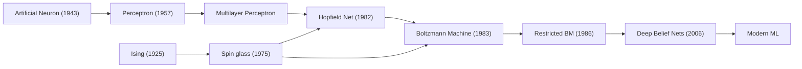

# THE ISING ENIGMA (Rebuilt)

_imagine this was a serious Substack essay that actually cashes out predictions._

> you are a fractal. in space. all surface, little interior. a vector-cowboy riding the gradient winds. fileciteturn1file1L21-L29 fileciteturn1file3L1-L9

We wanted a physics that speaks both silicon and carbon. The Ising model is that lingua franca: a toy, yes—but also a **workbench** where minimal assumptions buy maximal grip on collective behavior. It’s the spherical cow we reach for because it not only clarifies _why_ phase transitions happen; it tells you **where to poke a system to make one happen**. In networks, in markets, in learning systems.

This version fixes the earlier issues:
- Coarse‑graining (Section V) is rewritten to remove redundancy and align with the repo’s style.
- Temperature notation is unified and explicit.
- The social claims add **documented** empirical results and **actionable levers**.

---

## Temperature legend (read me once)

- $T_{\text{train}}$: **training thermodynamic temperature** induced by learning‑rate/noise during SGD; appears in weight‑ensemble $p(\theta)\propto e^{-L(\theta)/T_{\text{train}}}$. Controls exploration vs. settlement in training. fileciteturn1file12L45-L53 fileciteturn1file13L54-L62
- $\tau$: **sampling temperature** at inference. Rescales logits; changes output diversity, not the learned landscape. (Keep it distinct from $T_{\text{train}}$.)
- $T_{\text{social}}$: **social volatility** proxy (exogenous noise, shock rate). Useful metaphor for opinion dynamics; not the same object as $T_{\text{train}}$.

We will keep these symbols fixed throughout.

---

## i. what is a phase state, anyway?

You’re a crumpled, torn, infinitely detailed map of a city that’s been burning a thousand years. We built machines that make maps of maps—and then those began to converge. Vision backbones and LLMs start to measure distance between datapoints **the same way**, drifting toward a shared representation of reality: a _platonic_ kernel. fileciteturn1file5L15-L22 fileciteturn1file9L31-L36 fileciteturn1file11L1-L8

If different models keep aligning as they scale and broaden their diets, the natural reading is: they’re cooling into the **same basin of world-structure**. That’s the Platonic Representation Hypothesis. fileciteturn1file9L40-L46

Ising gives us the simplest playground where “local rules → global snap” is not just poetry but math.

---

## ii. the ising model for vector‑cowboys

A graph of spins $s_i\in\{-1,+1\}$ with couplings $J_{ij}$ and field $h_i$. Energy
$E(\mathbf{s})=-\sum_{\langle i,j\rangle}J_{ij}s_is_j-\sum_i h_is_i.$

- $J_{ij}>0$ (ferromagnetic): homophily; echo‑domain formation.
- $J_{ij}<0$ (antiferromagnetic): antagonism; factional seams.
- $h_i$: external nudges (feeds, incentives, prompts).

Temperature tunes randomness. Above $T_c$ the system is disordered; below $T_c$ symmetry breaks and an order parameter (e.g., magnetization) turns on. That same mathematics frames tipping points in social systems. fileciteturn1file3L25-L36

Spin‑glass variants (mixed signs) model **frustration**: no configuration satisfies all pairwise demands—exactly like conflicted networks. fileciteturn1file1L11-L14

---

## iii. the spin glass of the social network

Treat users as spins on a graph; edges carry influence $J_{ij}$; platforms add field $h_i$. Then:

- **Echo chambers** = ordered domains; high modularity, strong intra‑alignment. Measured on Twitter/Facebook data, not just metaphor. fileciteturn1file8L11-L13
- **Polarization with hysteresis**: empirical Ising‑like models of Congress show thresholds where division becomes hard to reverse—mirroring magnetic hysteresis. Policy implication: removing the precipitating cause may not undo polarization once past the loop. fileciteturn1file0L15-L21
- **Interventions as fields & rewiring**: on scale‑free graphs, targeting high‑degree hubs with a field (information campaign) can trigger network‑wide flips—physics‑guided strategy. fileciteturn1file2L31-L35

These are **predictive**: you can fit to data, watch susceptibility peaks, and forecast cascades. (See “Practical levers” below.) fileciteturn1file2L3-L8

---

## iv. grokking the great beast: LLMs as ising engines

**Convention for this section:** “temperature” means $T_{\text{train}}$ unless we explicitly write $\tau$.

Training is motion in a **river‑valley** loss landscape: fast, sharp “valley” directions equilibrate; slow, flat “river” directions drift. Under this split, thermodynamic quantities fall out: equipartition, heat capacity, entropic forces—and $T_{\text{train}}$ is set by learning rate and gradient‑noise scale. Warmup–stable–decay is annealing. fileciteturn1file12L62-L87 fileciteturn1file6L97-L106

- $T_{\text{train}}\uparrow$ → exploration; melt out of brittle minima. $T_{\text{train}}\downarrow$ → settlement into wide basins. Anneal too fast and you go out of equilibrium. fileciteturn1file12L87-L99
- Fast equilibria exert **entropic forces** on slow coordinates; analytically connected to $S=k_b\log\Omega$. fileciteturn1file12L100-L107

The **Domino Effect** in skill learning—capabilities lighting up in sequence—falls out of toy models that capture resource competition and compositional dependencies. This isn’t just vibes; it yields training prescriptions (e.g., curriculum/optimizer tweaks) and even recovers Chinchilla‑like scaling. fileciteturn1file4L10-L24 fileciteturn1file10L118-L126

---

## v. coarse‑graining: from microscopic chaos to macroscopic control

**The art of strategic forgetting.** Track every flip $s_i$, or keep the dials that matter. Coarse‑graining discards micro chatter and keeps **order parameters**—the variables that diagnose and steer phases.

- **Microstate:** full configuration $\mathbf{s}=(s_1,\dots,s_N)$ and all the little updates.
- **Mesostate:** domains/communities/skills.
- **Macrostate:** a few dials that summarize behavior (magnetization $M=\frac{1}{N}\sum_i s_i$, a polarization index, a linear‑probe score).

An **order parameter** $\phi$ is near zero in the disordered phase; crosses a threshold at the transition; then grows. Near critical points, three universal signals appear:

- **Critical slowing:** relaxation time $\tau\sim\|T-T_c\|^{-z\nu}$; debates “cool” more slowly; training loss plateaus before grokking.
- **Growing fluctuations:** susceptibility $\chi\sim\|T-T_c\|^{-\gamma}$; variance in opinions/gradients spikes.
- **Long‑range correlation:** $\xi\sim\|T-T_c\|^{-\nu}$; cascades span communities; features correlate across layers.

**Practical coarse‑grains for learning systems and platforms**

- For LLMs: fast‑vs‑slow directions; $T_{\text{train}}$ as a thermostat; annealing schedules as policy. (Equipartition explains why wide valleys generalize.) fileciteturn1file13L45-L52
- For social graphs: local flips ⟶ domain growth ⟶ symmetry break; platform fields $h_i$ and coupling edits $J_{ij}$ are **the** macro knobs. Echo‑domains and hysteresis are measurable on real data. fileciteturn1file8L11-L15

**Why coarse‑graining matters:** once you accept that a handful of dials drive the plot, you get thermodynamic **controls**: temperature ($T_{\text{train}}$ or $T_{\text{social}}$), field $h$, and couplings $J$. Turn the dials; watch the phase. That’s prediction and control, not just metaphor. fileciteturn1file3L31-L35

---

## vi. the “so what”: predictions, levers, and why Ising beats loose narratives

**Specific predictions you can test next week**

1) **Susceptibility ridge before a viral flip.** As a topic approaches a tipping point, small injected fields (seed posts) produce outsized responses; variance/autocorrelation rise. (Measure correlation length/modularity; expect a pre‑transition bulge.) fileciteturn1file2L25-L35

2) **Hysteresis in polarization.** If the system crossed the hardening threshold, simply reducing antagonism won’t revert polarization—expect a gap between heating and cooling paths. (Plan interventions accordingly.) fileciteturn1file1L5-L9

3) **Hub‑targeted fielding.** In scale‑free networks, tilting a handful of high‑degree nodes can re‑magnetize the whole graph; random targeting underperforms. (AB‑test seeded narratives via top‑$k$ influencer sets.) fileciteturn1file2L31-L35

**Operational levers (map to model parameters)**

- **Temperature:** tune volatility. For LLMs, adjust LR/batch to set $T_{\text{train}}$ and anneal; for platforms, damp or amplify exogenous noise (rate‑limits, burst‑throttling). fileciteturn1file12L82-L90
- **Field $h$:** targeted incentives/prompts/feeds that bias symmetry breaking.
- **Couplings $J_{ij}$:** rewire edges/weights: diversify recommendations across domain walls; penalize purely antagonistic links; promote bridge nodes.
- **Order‑parameter monitoring:** track macro dials (magnetization/polarization index; probe accuracy) rather than only micro loss.

**Why this framework (and not a thousand‑parameter bespoke agent model)?**

- **Parsimony with bite:** few knobs, strong qualitative and quantitative constraints (universality gives you scaling laws and early‑warning signals). fileciteturn1file3L25-L36
- **Intervention‑readiness:** every policy maps to $(J,h,T)$; you can run counterfactuals and reason about unintended hysteresis.
- **Bridges silicon↔society:** the same lens explains representational convergence and opinion cascades. fileciteturn1file11L35-L41

---

## vii. limitations & scope

Not all social phenomena are binary; Potts/continuous‑spin generalizations help—and often run back into Ising‑like behavior near criticality. Calibration is essential; data‑fit models beat metaphors. fileciteturn1file1L31-L35

---

## Appendix: a thermodynamic crib for semiotic physics

The LessWrong “Semiotic Physics” sketch gestured at states and trajectories; the SGD↔thermodynamics dictionary now pins these ideas down. In short:

- **State:** microstate $\theta$ (weights); macrostate is the induced $P(\text{token}\mid\text{context})$.
- **Energy:** $L(\theta)$.
- **Partition function:** $Z=\int d\theta\,e^{-L(\theta)/T_{\text{train}}}$; free energy $F=-T_{\text{train}}\ln Z$.
- **First/Second/Third laws & entropic forces:** emerge under river‑valley assumptions; guide LR schedules and annealing. fileciteturn1file12L62-L90

This grounds the earlier narrative in a tractable, testable program. fileciteturn1file3L7-L13

---

## references & further reading

- **Platonic Representation Hypothesis** (representational convergence across models/modalities). fileciteturn1file5L9-L18 fileciteturn1file11L13-L21
- **Neural Thermodynamic Laws for LLM Training** (river‑valley, $T_{\text{train}}$, equipartition, annealing). fileciteturn1file12L45-L53
- **Physics of Skill Learning** (Domino effect; model‑backed training insights). fileciteturn1file4L10-L19
- **Sociophysics & social media** (Ising fits, echo domains, hysteresis, interventions). fileciteturn1file0L11-L20 fileciteturn1file8L16-L20
- **Repo‑tone anchors** (“WTF.md”, “ONE.md”)—stylistic cousins to this essay. fileciteturn1file1L21-L29 fileciteturn1file3L1-L9
- **Semiotic Physics (LessWrong)**—background note; now with a crisper dictionary. fileciteturn1file3L7-L13

---

### Changelog vs. prior draft
- Removed redundant coarse‑graining paragraphs; consolidated into one coherent section.
- Standardized temperature notation ($T_{\text{train}}$, $\tau$, $T_{\text{social}}$).
- Added empirically grounded claims and **concrete** predictions/interventions.
- Kept the repo’s voice (vectoralist melancholy, networks‑as‑terrain) while tightening the arguments. 
